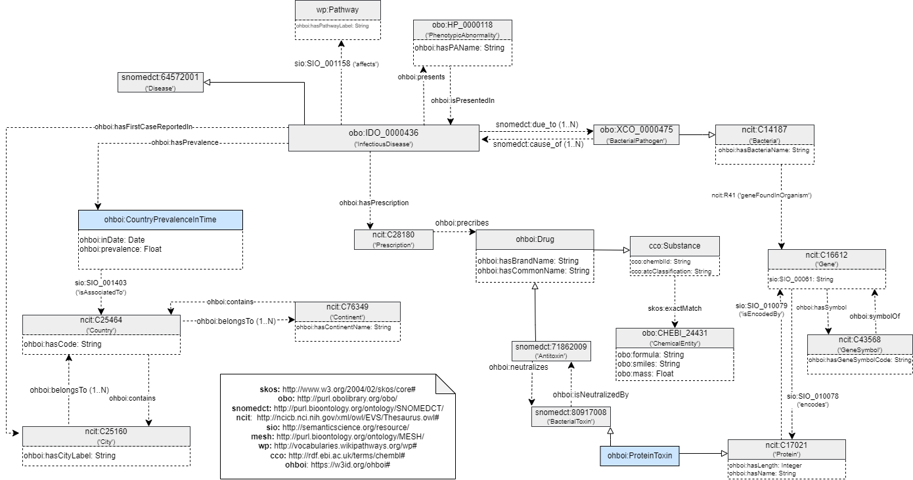

## Ontology evaluation through Competency Questions (CQ) addressing

The following contents of this folder implement data retrieval, reformatting, KG construction and access to evaluate the CQ specified in the ORSD document for OhBOI to develop traceability of requirements in the ontology implementation process, as established by the LOD methodology.

A Knowledge Graph of the following represented subset of the OhBOI ontology will be materialized:

The files to implement this process being,

| File-Folder  |      Description      |  Used in |
|----------|:-------------:|------:|
| data_files | Curated and formatted files | KG generation |
| data_retrieval_and_reformatting | Programmatic data retrieval and reformatting   | KG generation |
| mapping_files | Mapping rules with terms and associations in OhBOI for data sources for KG generation | KG generation |
| `OhBOI_RDF` | Final RDF triple file generated through Morph-KGC  | KG access |
| `OntologyValidation_KGConstruction_and_CQ.ipynb` | Script implementing KG generation and access to address OhBOI CQ | KG generation and access --> **CQ evaluation** |
