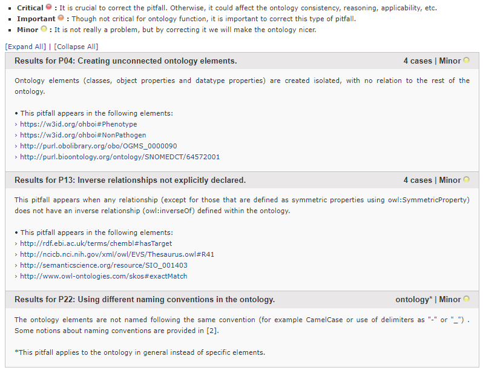

# Open Bacterial Ontology for Infectious diseases! - O(h)BOI!

This ontology has been developed for the final project of the Semantic Technologies course of the MSc in Computational Biology (2022-2023). 

### Purpose

In the present work we propose the ontology Open Bacterial Ontology for Infectious diseases, O(h)BOI!, an ontology that will create a knowledge base model around human bacteria-caused infectious diseases comprising medical, epidemiological, microbiological and molecular data. 

## Documentation

Documentation can be found in a series of HTML files and AR2D2 visualizations within the `OnToology/ohboi_rdfxml.owl` folder

Other files within the repository include code, data and reports for the ontology evaluation stage, the requirement files and the final RDF XML and OWL serializations of the final ontology. These are specifically:

| Version/Date| File/Folder   |      Description      |  Used in |
|----------|:----------|:-------------:|------:|
| v.2.*(21/01/2023)* | `ORSD_OhBOI.pdf` |  ORSD file with requirements for OhBOI ontology | Ontology Conceptualization |
| v.2.*(23/01/2023)*| `ohboi_rdfxml.owl` |  RDF file with the last version of the ontology in RDF-XML | Last version of implemented ontology - Documentation |
| v.2.*(23/01/2023)*| `ohboi_turtle.owl` | RDF file with the last version of the ontology in Turtle serialization | Last version of implemented ontology |
| v.1.*(22/01/2023)*| `Ontology_Evaluation_through_CQ` | RDF file with the last version of the ontology in RDF-XML | Ontology evaluation |
| v.2.*(23/01/2023)*| `OhBOI_RDFgraph` | Final ontology schema RDF graph in a png file | Ontology implementation |
| v.1.*(23/01/2023)*| `OOPS_report.png` | [OOPS! (OntOlogy Pitfall Scanner!)](https://oops.linkeddata.es/) evaluation report | Ontology evaluation |
| v.1.*(23/01/2023)*| `OnToology/ohboi_rdfxml.owl/` | Documentation of the ontology generated with [OnToology](http://ontoology.linkeddata.es/) tool| Ontology documentation |

## Evaluation

Evaluation of the formal part of the ontology was addressed through Competency Questions (CQ) and OOPS! pitfall scanning. As a result, the ontology was compliant with the final selected requirements, and there were a __ number of 3 minor pitfalls found by OOPS (p04, p13, p22), which are more deeply discussed in [OOPS! pitfall catalogue](https://oops.linkeddata.es/catalogue.jsp)

### Contributors

Credits go to Natalia García and Ana Solbas. 

### Liscense

 This work is licensed under a <a rel="license" href="http://creativecommons.org/licenses/by/3.0/">Creative Commons Attribution 3.0 Unported License</a>.
